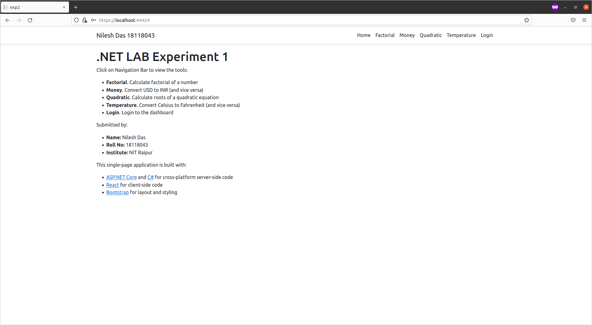
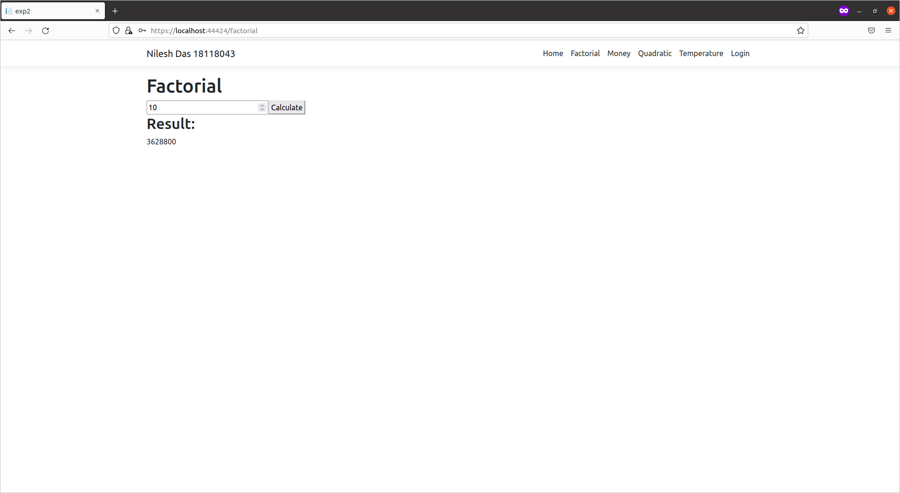
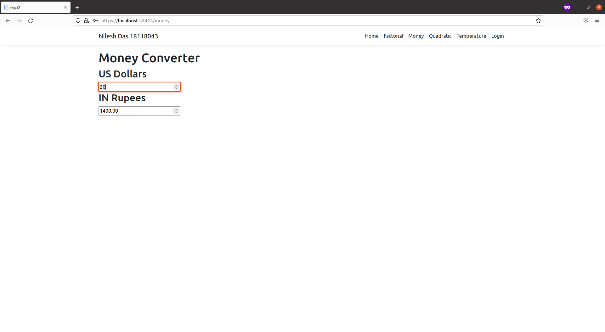
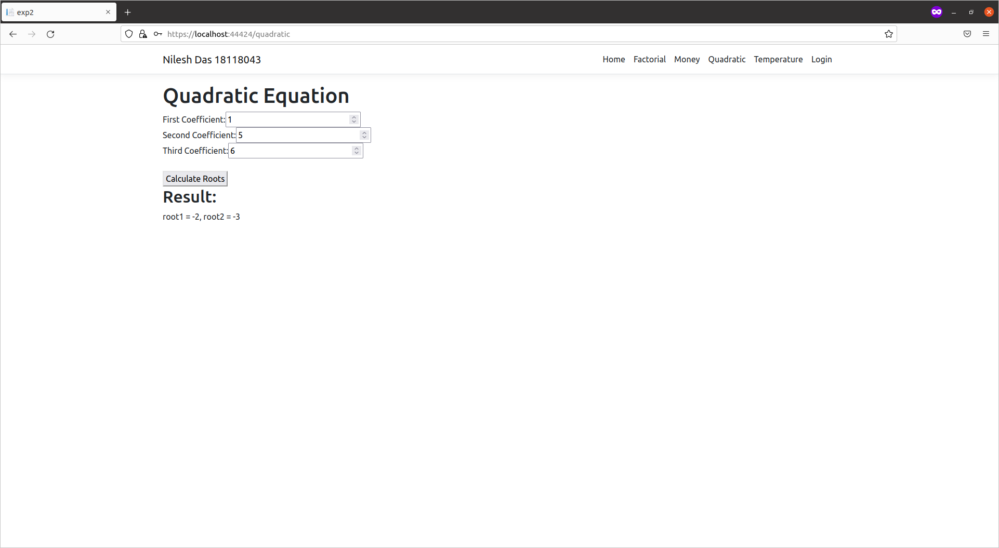
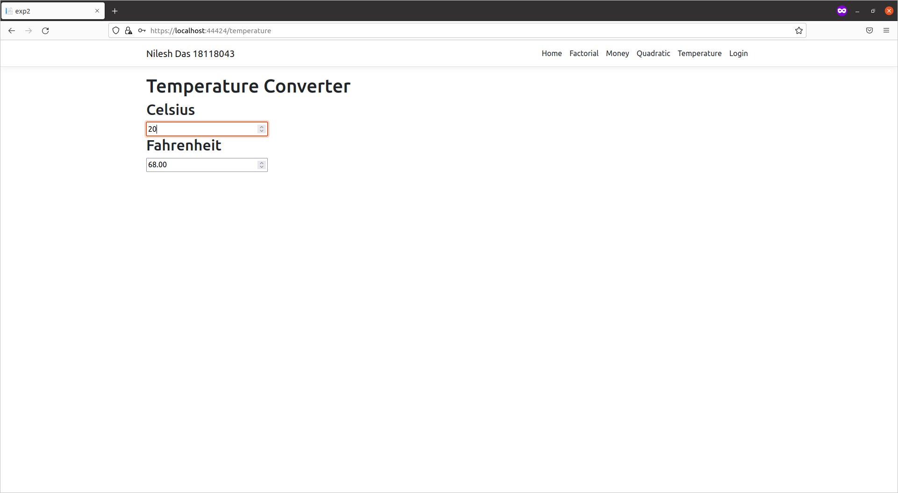
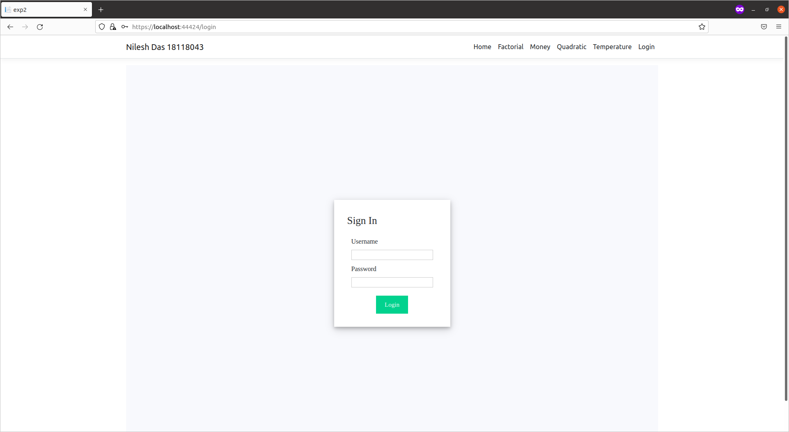

# NET LAB Experiment 1

View the solution code in: [`ClientApp/src/components`](ClientApp/src/components)

Click on Navigation Bar to view the tools:

- Factorial: Calculate factorial of a number
- Money: Convert USD to INR (and vice versa)
- Quadratic: Calculate roots of a quadratic equation
- Temperature: Convert Celsius to Fahrenheit (and vice versa)
- Login: Login to the dashboard

Submitted by:

- Name: Nilesh Das
- Roll No: 18118043
- Institute: NIT Raipur

